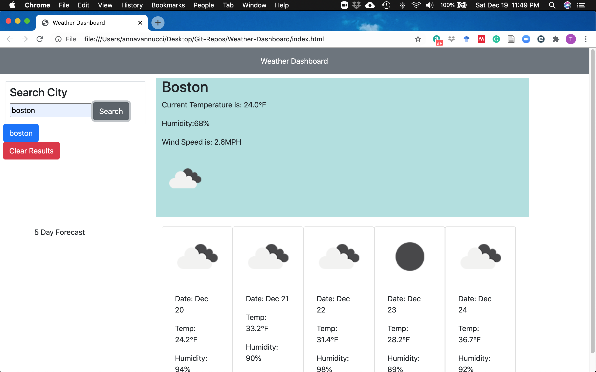

# Weather-Dashboard

Purpose - The purpose of this assignment was to design an application for a dynamic weather display application that would allow the user to search for a city, and get that day's weather along with the 5 day forecast

Instructions - The user has access to a searchbar on the lefthand side to begin, where they enter the name of a city. Upon entering the name of the city, a new button is created below the search bar with the name of the city for reference later on to be pulled from local storage. once the user searches for a city, that day's forecast appears in a container, along with a 5 day forecast in a seperate container.

Built Using: HTML, CSS, and Javascript with utilization of Jquery, Luxon, and the openweathermap.org API

link to page: https://trumore.github.io/Weather-Dashboard/

Screenshot:

Credits - Built by Tom Romore and with collaboration by the Columbia FullStack Study Group
